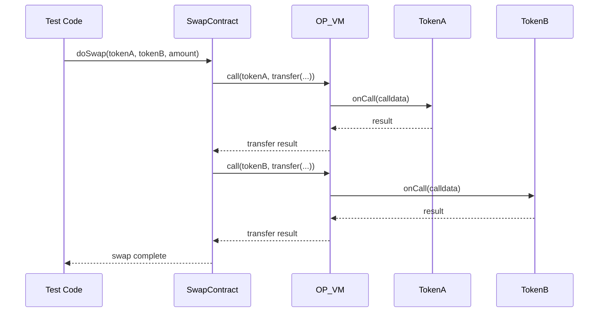

# Cross-Contract Calls

When testing contracts that call other contracts, all contracts must be registered with the `Blockchain` singleton. The VM automatically routes cross-contract calls.

---

## Setup

Register all contracts that participate in cross-contract calls:

```typescript
import { opnet, OPNetUnit, Assert, Blockchain, OP20 } from '@btc-vision/unit-test-framework';

await opnet('Cross-Contract Tests', async (vm: OPNetUnit) => {
    let tokenA: OP20;
    let tokenB: OP20;
    let swap: MySwapContract;

    const deployer = Blockchain.generateRandomAddress();

    vm.beforeEach(async () => {
        Blockchain.dispose();
        Blockchain.clearContracts();
        await Blockchain.init();

        // Register all contracts
        tokenA = new OP20({
            address: Blockchain.generateRandomAddress(),
            deployer, file: './bytecodes/TokenA.wasm', decimals: 18,
        });
        tokenB = new OP20({
            address: Blockchain.generateRandomAddress(),
            deployer, file: './bytecodes/TokenB.wasm', decimals: 18,
        });
        swap = new MySwapContract(deployer, Blockchain.generateRandomAddress());

        Blockchain.register(tokenA);
        Blockchain.register(tokenB);
        Blockchain.register(swap);

        await tokenA.init();
        await tokenB.init();
        await swap.init();

        Blockchain.msgSender = deployer;
        Blockchain.txOrigin = deployer;
    });

    vm.afterEach(() => {
        tokenA.dispose();
        tokenB.dispose();
        swap.dispose();
        Blockchain.dispose();
    });

    await vm.it('should swap tokens', async () => {
        // Mint tokens to the swap contract
        await tokenA.mintRaw(swap.address, Blockchain.expandTo18Decimals(10000));
        await tokenB.mintRaw(swap.address, Blockchain.expandTo18Decimals(10000));

        // Execute swap - internally calls tokenA and tokenB
        await swap.doSwap(tokenA.address, tokenB.address, 100n);

        // Verify balances changed
        const balanceA = await tokenA.balanceOf(swap.address);
        const balanceB = await tokenB.balanceOf(swap.address);

        vm.info(`Token A: ${balanceA}`);
        vm.info(`Token B: ${balanceB}`);
    });
});
```

---

## How It Works



When a contract executes a `call` instruction, the VM:

1. Looks up the target address in `Blockchain`'s contract registry
2. Invokes `onCall()` on the target `ContractRuntime`
3. Returns the result to the calling contract

---

## Call Stack Tracking

The `callStack` in `CallResponse` tracks the full chain of calls:

```typescript
await vm.it('should track call stack', async () => {
    Blockchain.traceCalls = true;

    const response = await swap.doSwap(tokenA.address, tokenB.address, 100n);

    // callStack contains all contracts involved
    for (const addr of response.callStack) {
        vm.info(`Called: ${addr.toHex()}`);
    }
});
```

---

## State Isolation

Each registered contract maintains its own storage. Cross-contract calls modify the target contract's state:

```typescript
await vm.it('should modify both contract states', async () => {
    const aliceBalanceBefore = await tokenA.balanceOf(alice);

    await swap.doSwap(tokenA.address, tokenB.address, 100n);

    const aliceBalanceAfter = await tokenA.balanceOf(alice);
    // Balance changed because swap called tokenA.transfer internally
});
```

---

## State Backup/Restore

Use backup/restore for scenarios where you need to test different paths without re-initializing:

```typescript
await vm.it('should compare two scenarios', async () => {
    // Setup initial state
    await tokenA.mintRaw(alice, 1000n);

    // Backup
    Blockchain.backupStates();

    // Scenario A
    await swap.doSwap(tokenA.address, tokenB.address, 100n);
    const balanceA = await tokenA.balanceOf(alice);

    // Restore to pre-swap state
    Blockchain.restoreStates();

    // Scenario B
    await swap.doSwap(tokenA.address, tokenB.address, 200n);
    const balanceB = await tokenA.balanceOf(alice);

    Assert.expect(balanceA).toNotEqual(balanceB);
});
```

---

[<- Previous: Utilities](../api-reference/utilities.md) | [Next: Upgradeable Contracts ->](./upgradeable-contracts.md)
