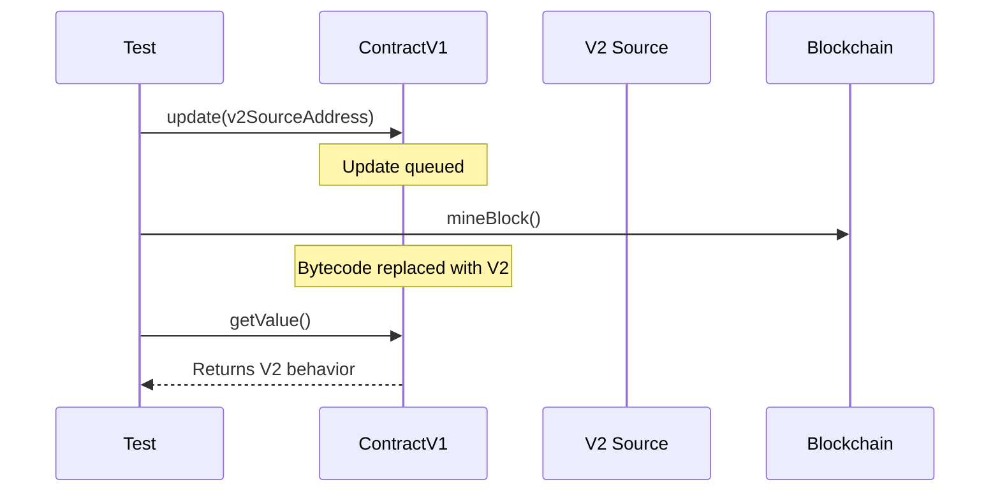

# Updatable Contracts

OPNet supports contract updates via `updateFromAddress`. The new bytecode is sourced from another registered contract and takes effect on the next block.

---

## How Updates Work



Key points:
- Updates are **queued**, not immediate
- The new bytecode takes effect after `Blockchain.mineBlock()`
- Storage is **preserved** across updates
- Only **one update per block** is allowed
- The contract **address stays the same**
- Cross-contract calls are **blocked** after updating in the same execution

---

## Internal Mechanism

The update process has two phases:

### Phase 1: Update Request (`updateFromAddress`)

When a contract calls `updateFromAddress`:

1. A **temporary WASM instance** is created with the **current** bytecode (using `bypassCache: true` to avoid reusing the paused instance)
2. `onUpdate(calldata)` is called on this temporary instance, giving the current contract a chance to run migration logic
3. If `onUpdate` succeeds, the new bytecode is **queued** as a pending update for the current block
4. The `_hasUpdatedInCurrentExecution` flag is set, **blocking** any further cross-contract calls (`Blockchain.call`) in the same transaction

### Phase 2: Bytecode Swap (`applyPendingBytecodeUpdate`)

On the **next block** (when `Blockchain.blockNumber > pendingBytecodeBlock`):

1. The bytecode is swapped to the new version
2. A **temporary WASM instance** is created with the **new** bytecode (using `bypassCache: true` to ensure the fresh bytecode is loaded without hitting the module cache)
3. `onUpdate(calldata)` is called on the new bytecode, allowing the new version to run its own initialization/migration logic
4. If `onUpdate` fails on the new bytecode, the **update is reverted** back to the previous bytecode
5. The pending update state is cleared

### Response Format

The `updateFromAddress` response uses the format: `[bytecodeLength(4) | executionCost(8) | exitStatus(4) | exitData]` (no address prefix, unlike `deployContractAtAddress`).

---

## Setup

You need two contracts: the main contract and a source contract that holds the V2 bytecode:

```typescript
import { Address } from '@btc-vision/transaction';
import { BytecodeManager, ContractRuntime, opnet, OPNetUnit, Assert, Blockchain } from '@btc-vision/unit-test-framework';
import { UpdatableContractRuntime } from './UpdatableContractRuntime.js';

// Source contract just provides bytecode
class V2SourceContract extends ContractRuntime {
    constructor(deployer: Address, address: Address) {
        super({ address, deployer, gasLimit: 150_000_000_000n });
    }

    protected handleError(error: Error): Error {
        return new Error(`(V2Source) ${error.message}`);
    }

    protected defineRequiredBytecodes(): void {
        BytecodeManager.loadBytecode('./bytecodes/ContractV2.wasm', this.address);
    }
}
```

---

## Test Examples

### Basic Update

```typescript
await opnet('Update Tests', async (vm: OPNetUnit) => {
    let contract: UpdatableContractRuntime;
    let v2Source: V2SourceContract;

    const deployer = Blockchain.generateRandomAddress();
    const contractAddress = Blockchain.generateRandomAddress();
    const v2Address = Blockchain.generateRandomAddress();

    vm.beforeEach(async () => {
        Blockchain.dispose();
        Blockchain.clearContracts();
        await Blockchain.init();

        contract = new UpdatableContractRuntime(deployer, contractAddress);
        v2Source = new V2SourceContract(deployer, v2Address);

        Blockchain.register(contract);
        Blockchain.register(v2Source);

        await contract.init();
        await v2Source.init();

        Blockchain.txOrigin = deployer;
        Blockchain.msgSender = deployer;
    });

    vm.afterEach(() => {
        contract.dispose();
        v2Source.dispose();
        Blockchain.dispose();
    });

    await vm.it('should not apply update on same block', async () => {
        Assert.expect(await contract.getValue()).toEqual(1);

        await contract.update(v2Address);

        // Same block: still V1 behavior
        Assert.expect(await contract.getValue()).toEqual(1);
    });

    await vm.it('should apply update after mining', async () => {
        await contract.update(v2Address);
        Blockchain.mineBlock();

        // Now V2 behavior
        Assert.expect(await contract.getValue()).toEqual(2);
    });
});
```

### Storage Persistence

```typescript
await vm.it('should preserve storage across update', async () => {
    const key = new Uint8Array(32);
    key[31] = 42;
    const value = new Uint8Array(32);
    value[31] = 99;

    // Store value with V1
    await contract.storeValue(key, value);

    // Update to V2
    await contract.update(v2Address);
    Blockchain.mineBlock();

    // Value persists with V2
    const loaded = await contract.loadValue(key);
    Assert.expect(loaded).toDeepEqual(value);
});
```

### Error Handling

```typescript
await vm.it('should revert for non-existent source', async () => {
    const fakeAddress = Blockchain.generateRandomAddress();

    await Assert.expect(async () => {
        await contract.update(fakeAddress);
    }).toThrow();
});

await vm.it('should reject second update in same block', async () => {
    await contract.update(v2Address);

    await Assert.expect(async () => {
        await contract.update(v2Address);
    }).toThrow();
});
```

### Gas Tracking

```typescript
await vm.it('should measure update gas cost', async () => {
    const response = await contract.update(v2Address);
    Assert.expect(response.usedGas).toBeGreaterThan(0n);
    vm.info(`Update gas: ${response.usedGas}`);
});
```

---

[<- Previous: Cross-Contract Calls](./cross-contract-calls.md) | [Next: Transaction Simulation ->](./transaction-simulation.md)
