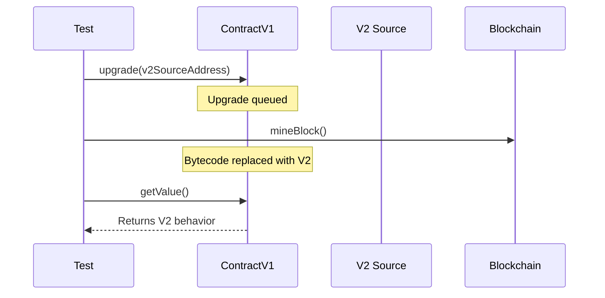

# Upgradeable Contracts

OPNet supports contract upgrades via `updateFromAddress`. The new bytecode is sourced from another registered contract and takes effect on the next block.

---

## How Upgrades Work



Key points:
- Upgrades are **queued**, not immediate
- The new bytecode takes effect after `Blockchain.mineBlock()`
- Storage is **preserved** across upgrades
- Only **one upgrade per block** is allowed
- The contract **address stays the same**

---

## Setup

You need two contracts: the main contract and a source contract that holds the V2 bytecode:

```typescript
import { Address } from '@btc-vision/transaction';
import { BytecodeManager, ContractRuntime, opnet, OPNetUnit, Assert, Blockchain } from '@btc-vision/unit-test-framework';
import { UpgradeableContractRuntime } from './UpgradeableContractRuntime.js';

// Source contract just provides bytecode
class V2SourceContract extends ContractRuntime {
    constructor(deployer: Address, address: Address) {
        super({ address, deployer, gasLimit: 150_000_000_000n });
    }

    protected handleError(error: Error): Error {
        return new Error(`(V2Source) ${error.message}`);
    }

    protected defineRequiredBytecodes(): void {
        BytecodeManager.loadBytecode('./bytecodes/ContractV2.wasm', this.address);
    }
}
```

---

## Test Examples

### Basic Upgrade

```typescript
await opnet('Upgrade Tests', async (vm: OPNetUnit) => {
    let contract: UpgradeableContractRuntime;
    let v2Source: V2SourceContract;

    const deployer = Blockchain.generateRandomAddress();
    const contractAddress = Blockchain.generateRandomAddress();
    const v2Address = Blockchain.generateRandomAddress();

    vm.beforeEach(async () => {
        Blockchain.dispose();
        Blockchain.clearContracts();
        await Blockchain.init();

        contract = new UpgradeableContractRuntime(deployer, contractAddress);
        v2Source = new V2SourceContract(deployer, v2Address);

        Blockchain.register(contract);
        Blockchain.register(v2Source);

        await contract.init();
        await v2Source.init();

        Blockchain.txOrigin = deployer;
        Blockchain.msgSender = deployer;
    });

    vm.afterEach(() => {
        contract.dispose();
        v2Source.dispose();
        Blockchain.dispose();
    });

    await vm.it('should not apply upgrade on same block', async () => {
        Assert.expect(await contract.getValue()).toEqual(1);

        await contract.upgrade(v2Address);

        // Same block: still V1 behavior
        Assert.expect(await contract.getValue()).toEqual(1);
    });

    await vm.it('should apply upgrade after mining', async () => {
        await contract.upgrade(v2Address);
        Blockchain.mineBlock();

        // Now V2 behavior
        Assert.expect(await contract.getValue()).toEqual(2);
    });
});
```

### Storage Persistence

```typescript
await vm.it('should preserve storage across upgrade', async () => {
    const key = new Uint8Array(32);
    key[31] = 42;
    const value = new Uint8Array(32);
    value[31] = 99;

    // Store value with V1
    await contract.storeValue(key, value);

    // Upgrade to V2
    await contract.upgrade(v2Address);
    Blockchain.mineBlock();

    // Value persists with V2
    const loaded = await contract.loadValue(key);
    Assert.expect(loaded).toDeepEqual(value);
});
```

### Error Handling

```typescript
await vm.it('should revert for non-existent source', async () => {
    const fakeAddress = Blockchain.generateRandomAddress();

    await Assert.expect(async () => {
        await contract.upgrade(fakeAddress);
    }).toThrow();
});

await vm.it('should reject second upgrade in same block', async () => {
    await contract.upgrade(v2Address);

    await Assert.expect(async () => {
        await contract.upgrade(v2Address);
    }).toThrow();
});
```

### Gas Tracking

```typescript
await vm.it('should measure upgrade gas cost', async () => {
    const response = await contract.upgrade(v2Address);
    Assert.expect(response.usedGas).toBeGreaterThan(0n);
    vm.info(`Upgrade gas: ${response.usedGas}`);
});
```

---

[<- Previous: Cross-Contract Calls](./cross-contract-calls.md) | [Next: Transaction Simulation ->](./transaction-simulation.md)
