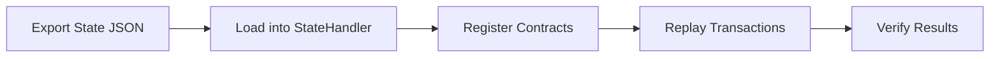

# Block Replay

Replay real mainnet/testnet transactions in a test environment for debugging production issues.

---

## Overview

Block replay loads contract state and transactions from exported data (e.g., MongoDB dumps) and re-executes them locally against the OP_VM.



---

## Loading State

Load contract state from JSON files:

```typescript
import { StateHandler, Blockchain, ContractRuntime, BytecodeManager } from '@btc-vision/unit-test-framework';
import { Address } from '@btc-vision/transaction';
import * as fs from 'fs';

// Parse state file (pointer -> value mapping)
function loadStatesFromFile(filePath: string): FastMap<bigint, bigint> {
    const raw = fs.readFileSync(filePath, 'utf-8');
    const states = new FastMap<bigint, bigint>();

    // Parse your export format (e.g., JSON array of [pointer, value])
    const entries = JSON.parse(raw);
    for (const [key, value] of entries) {
        states.set(BigInt(key), BigInt(value));
    }

    return states;
}

// Load state for a contract
const contractAddress = Address.fromString('0x...');
const states = loadStatesFromFile('./state-dump/nativeswap-state.json');

StateHandler.overrideStates(contractAddress, states);
StateHandler.overrideDeployment(contractAddress);
```

---

## Contract Manager Pattern

Create a `ContractManager` class that loads all contracts involved:

```typescript
class ContractManager {
    private contracts: Map<string, ContractRuntime> = new Map();

    async loadContract(
        address: Address,
        deployer: Address,
        wasmPath: string,
        statePath?: string,
    ): Promise<ContractRuntime> {
        const contract = new GenericContractRuntime(deployer, address, wasmPath);
        Blockchain.register(contract);
        await contract.init();

        if (statePath) {
            const states = loadStatesFromFile(statePath);
            StateHandler.overrideStates(address, states);
            StateHandler.overrideDeployment(address);
        }

        this.contracts.set(address.toHex(), contract);
        return contract;
    }

    dispose(): void {
        for (const contract of this.contracts.values()) {
            contract.dispose();
        }
    }
}
```

---

## Replaying Transactions

Load and re-execute transactions from exported data:

```typescript
import { Transaction, TransactionInput, TransactionOutput, generateTransactionId } from '@btc-vision/unit-test-framework';

interface RawTransaction {
    inputs: Array<{ txHash: string; outputIndex: number }>;
    outputs: Array<{ to: string; value: string }>;
    calldata: string;
    sender: string;
}

async function replayTransaction(
    contract: ContractRuntime,
    rawTx: RawTransaction,
): Promise<void> {
    // Build Bitcoin transaction context
    const tx = new Transaction(
        generateTransactionId(),
        rawTx.inputs.map(i => new TransactionInput({
            txHash: Buffer.from(i.txHash, 'hex'),
            outputIndex: i.outputIndex,
            scriptSig: new Uint8Array(0),
            flags: 0,
        })),
        [],
    );

    for (const out of rawTx.outputs) {
        tx.addOutput(BigInt(out.value), out.to);
    }

    // Set transaction context
    Blockchain.transaction = tx;
    Blockchain.msgSender = Address.fromString(rawTx.sender);
    Blockchain.txOrigin = Address.fromString(rawTx.sender);

    // Execute
    const calldata = Buffer.from(rawTx.calldata, 'hex');
    const response = await contract.execute({ calldata });

    if (response.error) {
        console.error('Transaction reverted:', response.error.message);
    } else {
        console.log('Gas used:', response.usedGas);
    }
}
```

---

## Full Replay Test

```typescript
import { opnet, OPNetUnit, Blockchain } from '@btc-vision/unit-test-framework';

await opnet('Block Replay', async (vm: OPNetUnit) => {
    const manager = new ContractManager();

    vm.beforeEach(async () => {
        Blockchain.dispose();
        Blockchain.clearContracts();
        await Blockchain.init();

        // Load all contracts with their state
        await manager.loadContract(
            nativeSwapAddress, deployer,
            './bytecodes/NativeSwap.wasm',
            './state-dump/nativeswap.json',
        );

        await manager.loadContract(
            tokenAddress, deployer,
            './bytecodes/Token.wasm',
            './state-dump/token.json',
        );
    });

    vm.afterEach(() => {
        manager.dispose();
        Blockchain.dispose();
    });

    await vm.it('should replay block 12345', async () => {
        // Load transactions for this block
        const transactions = JSON.parse(
            fs.readFileSync('./blocks/block-12345.json', 'utf-8'),
        );

        Blockchain.blockNumber = 12345n;

        for (const rawTx of transactions) {
            await replayTransaction(contract, rawTx);
        }

        // Verify final state matches expected
        const reserve = await swap.getReserve();
        vm.info(`Final reserves: ${reserve.tokenReserve} / ${reserve.btcReserve}`);
    });
});
```

---

## Streaming JSON Parser

For large state files, use a streaming parser to avoid memory issues:

```typescript
import { createReadStream } from 'fs';
import { createInterface } from 'readline';

async function* streamStates(filePath: string): AsyncGenerator<[bigint, bigint]> {
    const stream = createReadStream(filePath, { encoding: 'utf-8' });
    const rl = createInterface({ input: stream });

    for await (const line of rl) {
        const parsed = JSON.parse(line);
        yield [BigInt(parsed.pointer), BigInt(parsed.value)];
    }
}

async function loadLargeStates(filePath: string): Promise<FastMap<bigint, bigint>> {
    const states = new FastMap<bigint, bigint>();
    for await (const [key, value] of streamStates(filePath)) {
        states.set(key, value);
    }
    return states;
}
```

---

## Tips

- Export state at a specific block height for reproducible debugging
- Load all contracts that participate in cross-contract calls
- Set `Blockchain.blockNumber` to match the block being replayed
- Compare `response.usedGas` against the original transaction receipt
- Use `Blockchain.traceGas = true` for detailed gas breakdowns

---

[<- Previous: NativeSwap Testing](./nativeswap-testing.md) | [Home: Documentation ->](../README.md)
