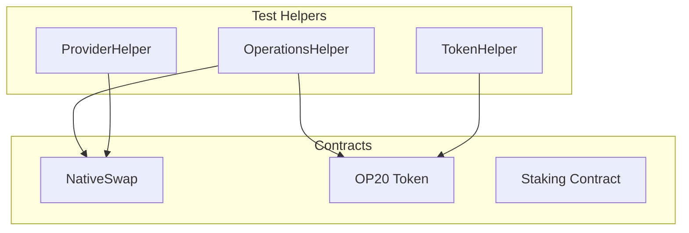

# NativeSwap Testing Example

This example shows how to test a complex DeFi contract (NativeSwap) with multiple contract interactions, liquidity management, and event decoding. Based on the real tests in [opnet-unit-test](https://github.com/btc-vision/opnet-unit-test).

---

## Architecture



---

## Contract Wrapper

Create a typed wrapper for NativeSwap extending `ContractRuntime`:

```typescript
import { Address, BinaryReader, BinaryWriter } from '@btc-vision/transaction';
import { BytecodeManager, CallResponse, ContractRuntime } from '@btc-vision/unit-test-framework';

export class NativeSwap extends ContractRuntime {
    private readonly createPoolSelector = this.getSelector('createPool(...)');
    private readonly listLiquiditySelector = this.getSelector('listLiquidity(...)');
    private readonly reserveSelector = this.getSelector('reserve(...)');
    private readonly swapSelector = this.getSelector('swap(...)');
    private readonly getReserveSelector = this.getSelector('getReserve()');

    constructor(deployer: Address, address: Address) {
        super({ address, deployer, gasLimit: 350_000_000_000n });
    }

    public async createPool(tokenAddress: Address, floorPrice: bigint, ...): Promise<CallResponse> {
        const calldata = new BinaryWriter();
        calldata.writeSelector(this.createPoolSelector);
        calldata.writeAddress(tokenAddress);
        calldata.writeU256(floorPrice);
        // ... encode remaining parameters

        const response = await this.execute({ calldata: calldata.getBuffer() });
        if (response.error) throw this.handleError(response.error);
        return response;
    }

    public async getReserve(): Promise<{ tokenReserve: bigint; btcReserve: bigint }> {
        const calldata = new BinaryWriter();
        calldata.writeSelector(this.getReserveSelector);

        const response = await this.execute({ calldata: calldata.getBuffer() });
        if (response.error) throw this.handleError(response.error);

        const reader = new BinaryReader(response.response);
        return {
            tokenReserve: reader.readU256(),
            btcReserve: reader.readU256(),
        };
    }

    // ... more methods

    protected handleError(error: Error): Error {
        return new Error(`(NativeSwap) ${error.message}`);
    }

    protected defineRequiredBytecodes(): void {
        BytecodeManager.loadBytecode('./bytecodes/NativeSwap.wasm', this.address);
    }

    private getSelector(sig: string): number {
        return Number(`0x${this.abiCoder.encodeSelector(sig)}`);
    }
}
```

---

## Test Structure

```typescript
import { opnet, OPNetUnit, Assert, Blockchain, OP20 } from '@btc-vision/unit-test-framework';
import { Address } from '@btc-vision/transaction';
import { NativeSwap } from '../contracts/NativeSwap.js';

await opnet('NativeSwap Pool Tests', async (vm: OPNetUnit) => {
    let swap: NativeSwap;
    let token: OP20;

    const deployer = Blockchain.generateRandomAddress();
    const provider = Blockchain.generateRandomAddress();
    const buyer = Blockchain.generateRandomAddress();

    vm.beforeEach(async () => {
        Blockchain.dispose();
        Blockchain.clearContracts();
        await Blockchain.init();

        // Create and register all contracts
        token = new OP20({
            address: Blockchain.generateRandomAddress(),
            deployer, file: './bytecodes/Token.wasm', decimals: 18,
        });

        swap = new NativeSwap(deployer, Blockchain.generateRandomAddress());

        Blockchain.register(token);
        Blockchain.register(swap);

        await token.init();
        await swap.init();

        Blockchain.txOrigin = deployer;
        Blockchain.msgSender = deployer;
    });

    vm.afterEach(() => {
        token.dispose();
        swap.dispose();
        Blockchain.dispose();
    });

    await vm.it('should create a pool', async () => {
        const response = await swap.createPool(
            token.address,
            Blockchain.expandTo18Decimals(1), // floor price
        );

        Assert.expect(response.usedGas).toBeGreaterThan(0n);
        vm.success('Pool created');
    });

    await vm.it('should list liquidity', async () => {
        // Create pool first
        await swap.createPool(token.address, Blockchain.expandTo18Decimals(1));

        // Mint tokens to provider
        await token.mintRaw(provider, Blockchain.expandTo18Decimals(10000));

        // List liquidity
        Blockchain.msgSender = provider;
        const response = await swap.listLiquidity(
            token.address,
            Blockchain.expandTo18Decimals(1000),
        );

        // Check events
        for (const event of response.events) {
            vm.info(`Event: ${event.type}`);
        }
    });

    await vm.it('should execute a swap', async () => {
        // Setup: create pool, list liquidity, reserve
        // ...

        const reserveBefore = await swap.getReserve();

        Blockchain.msgSender = buyer;
        const response = await swap.swap(/* ... */);

        const reserveAfter = await swap.getReserve();

        // Verify reserves changed
        Assert.expect(reserveAfter.tokenReserve).toNotEqual(reserveBefore.tokenReserve);
    });
});
```

---

## Helper Pattern

For complex DeFi testing, create helper classes that wrap common operations:

### Token Balance Helper

```typescript
class TokenHelper {
    constructor(private token: OP20) {}

    async assertBalance(address: Address, expected: bigint, label: string): Promise<void> {
        const balance = await this.token.balanceOf(address);
        Assert.expect(balance).toEqual(expected);
    }

    async assertBalanceChanged(
        address: Address,
        balanceBefore: bigint,
        expectedChange: bigint,
    ): Promise<void> {
        const balanceAfter = await this.token.balanceOf(address);
        Assert.expect(balanceAfter - balanceBefore).toEqual(expectedChange);
    }
}
```

### Operations Helper

```typescript
class OperationsHelper {
    constructor(
        private swap: NativeSwap,
        private token: OP20,
    ) {}

    async createPoolAndList(
        deployer: Address,
        provider: Address,
        tokenAmount: bigint,
    ): Promise<void> {
        // Create pool
        Blockchain.msgSender = deployer;
        await this.swap.createPool(this.token.address, Blockchain.expandTo18Decimals(1));

        // Mint and list
        await this.token.mintRaw(provider, tokenAmount);
        Blockchain.msgSender = provider;
        await this.swap.listLiquidity(this.token.address, tokenAmount);
    }

    async reserveAndSwap(buyer: Address, amount: bigint): Promise<CallResponse> {
        Blockchain.msgSender = buyer;
        await this.swap.reserve(amount);

        return await this.swap.swap(/* ... */);
    }
}
```

---

## Event Decoding

Decode contract events for validation:

```typescript
await vm.it('should emit correct events on swap', async () => {
    const response = await swap.swap(/* ... */);

    for (const event of response.events) {
        switch (event.type) {
            case 'SwapExecuted': {
                const decoded = decodeSwapEvent(event.data);
                vm.info(`Swapped: ${decoded.amountIn} -> ${decoded.amountOut}`);
                break;
            }
            case 'Transfer': {
                const decoded = OP20.decodeTransferredEvent(event.data);
                vm.info(`Transfer: ${decoded.from.toHex()} -> ${decoded.to.toHex()}: ${decoded.value}`);
                break;
            }
        }
    }
});
```

---

## Reentrancy Testing

Test that contracts are protected against reentrancy:

```typescript
await vm.it('should block reentrant calls', async () => {
    // ReentrantToken is an OP20 that calls back into NativeSwap
    const reentrantToken = new ReentrantToken({
        address: Blockchain.generateRandomAddress(),
        deployer, file: './bytecodes/ReentrantToken.wasm', decimals: 18,
    });

    Blockchain.register(reentrantToken);
    await reentrantToken.init();

    // Set callback to re-enter swap during transfer
    await reentrantToken.setCallback('swap');

    // Should revert due to reentrancy guard
    await Assert.expect(async () => {
        await swap.swap(/* ... */);
    }).toThrow();
});
```

---

[<- Previous: Consensus Rules](../advanced/consensus-rules.md) | [Next: Block Replay ->](./block-replay.md)
