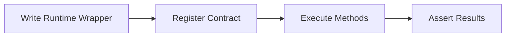
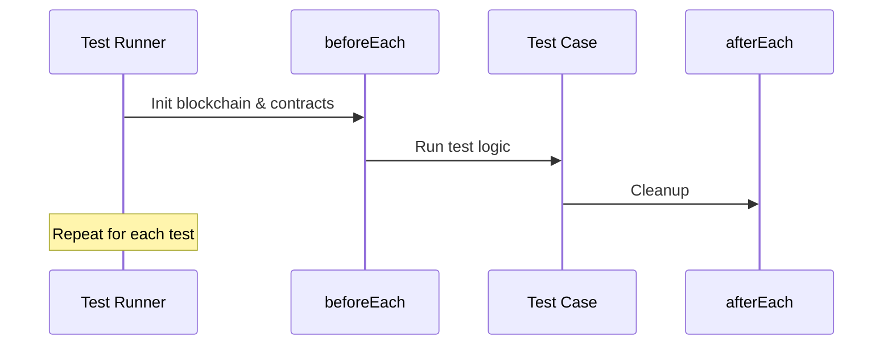

# Quick Start

This guide walks you through writing your first OPNet contract test, from project setup to a passing test suite.

## What We're Building

By the end of this guide, you'll be able to:

1. Create a contract runtime wrapper
2. Deploy and interact with a contract in tests
3. Assert on contract behavior



---

## Step 1: Create a Contract Runtime Wrapper

Every contract needs a typed wrapper that extends `ContractRuntime`. This maps TypeScript methods to the contract's ABI selectors:

```typescript
// test/runtime/MyTokenRuntime.ts
import { Address, BinaryReader, BinaryWriter } from '@btc-vision/transaction';
import { BytecodeManager, CallResponse, ContractRuntime } from '@btc-vision/unit-test-framework';

export class MyTokenRuntime extends ContractRuntime {
    private readonly balanceOfSelector: number = this.getSelector('balanceOf(address)');
    private readonly mintSelector: number = this.getSelector('mint(address,uint256)');

    public constructor(deployer: Address, address: Address) {
        super({
            address: address,
            deployer: deployer,
            gasLimit: 150_000_000_000n,
        });
    }

    public async balanceOf(owner: Address): Promise<bigint> {
        const calldata = new BinaryWriter();
        calldata.writeSelector(this.balanceOfSelector);
        calldata.writeAddress(owner);

        const response = await this.execute({ calldata: calldata.getBuffer() });
        this.handleResponse(response);

        const reader = new BinaryReader(response.response);
        return reader.readU256();
    }

    public async mint(to: Address, amount: bigint): Promise<CallResponse> {
        const calldata = new BinaryWriter();
        calldata.writeSelector(this.mintSelector);
        calldata.writeAddress(to);
        calldata.writeU256(amount);

        const response = await this.execute({ calldata: calldata.getBuffer() });
        this.handleResponse(response);
        return response;
    }

    protected handleError(error: Error): Error {
        return new Error(`(MyToken: ${this.address}) OP_NET: ${error.message}`);
    }

    protected defineRequiredBytecodes(): void {
        BytecodeManager.loadBytecode('./bytecodes/MyToken.wasm', this.address);
    }

    private getSelector(signature: string): number {
        return Number(`0x${this.abiCoder.encodeSelector(signature)}`);
    }

    private handleResponse(response: CallResponse): void {
        if (response.error) throw this.handleError(response.error);
        if (!response.response) throw new Error('No response to decode');
    }
}
```

---

## Step 2: Write the Test

```typescript
// test/my-token.test.ts
import { Address } from '@btc-vision/transaction';
import { opnet, OPNetUnit, Assert, Blockchain } from '@btc-vision/unit-test-framework';
import { MyTokenRuntime } from './runtime/MyTokenRuntime.js';

await opnet('MyToken Tests', async (vm: OPNetUnit) => {
    let token: MyTokenRuntime;

    const deployer: Address = Blockchain.generateRandomAddress();
    const alice: Address = Blockchain.generateRandomAddress();
    const contractAddress: Address = Blockchain.generateRandomAddress();

    vm.beforeEach(async () => {
        Blockchain.dispose();
        Blockchain.clearContracts();
        await Blockchain.init();

        token = new MyTokenRuntime(deployer, contractAddress);
        Blockchain.register(token);
        await token.init();

        Blockchain.txOrigin = deployer;
        Blockchain.msgSender = deployer;
    });

    vm.afterEach(() => {
        token.dispose();
        Blockchain.dispose();
    });

    await vm.it('should mint tokens', async () => {
        await token.mint(alice, 1000n);

        const balance = await token.balanceOf(alice);
        Assert.expect(balance).toEqual(1000n);
    });

    await vm.it('should start with zero balance', async () => {
        const balance = await token.balanceOf(alice);
        Assert.expect(balance).toEqual(0n);
    });

    await vm.it('should track gas usage', async () => {
        const response = await token.mint(alice, 500n);

        vm.info(`Gas used for mint: ${response.usedGas}`);
        Assert.expect(response.usedGas).toBeGreaterThan(0n);
    });

    await vm.it('should emit events', async () => {
        const response = await token.mint(alice, 100n);

        Assert.expect(response.events.length).toBeGreaterThan(0);
        vm.info(`Events emitted: ${response.events.length}`);
    });
});
```

---

## Step 3: Run the Test

```bash
npx tsx test/my-token.test.ts
```

You'll see output like:

```
[MyToken Tests] Starting...
  [PASS] should mint tokens (12ms)
  [PASS] should start with zero balance (3ms)
  [PASS] should track gas usage (8ms)
  [PASS] should emit events (7ms)
[MyToken Tests] All tests passed!
```

---

## Using Built-in Contract Helpers

For standard OP20/OP721 contracts, you don't need to write a custom runtime. The framework provides ready-made helpers:

```typescript
import { opnet, OPNetUnit, Assert, Blockchain, OP20 } from '@btc-vision/unit-test-framework';
import { Address } from '@btc-vision/transaction';

await opnet('OP20 Quick Test', async (vm: OPNetUnit) => {
    let token: OP20;
    const deployer: Address = Blockchain.generateRandomAddress();

    vm.beforeEach(async () => {
        Blockchain.dispose();
        Blockchain.clearContracts();
        await Blockchain.init();

        token = new OP20({
            address: Blockchain.generateRandomAddress(),
            deployer: deployer,
            file: './bytecodes/MyToken.wasm',
            decimals: 18,
        });

        Blockchain.register(token);
        await token.init();

        Blockchain.msgSender = deployer;
        Blockchain.txOrigin = deployer;
    });

    vm.afterEach(() => {
        token.dispose();
        Blockchain.dispose();
    });

    await vm.it('should read token metadata', async () => {
        const { metadata } = await token.metadata();

        vm.info(`Name: ${metadata.name}`);
        vm.info(`Symbol: ${metadata.symbol}`);
        vm.info(`Decimals: ${metadata.decimals}`);
    });

    await vm.it('should mint and check balance', async () => {
        const receiver = Blockchain.generateRandomAddress();
        await token.mint(receiver, 1000);

        const balance = await token.balanceOf(receiver);
        Assert.expect(balance).toEqual(Blockchain.expandToDecimal(1000, 18));
    });
});
```

---

## Test Lifecycle



Every test follows this lifecycle:

1. **`beforeEach`** - Initialize the blockchain, create and register contracts
2. **`vm.it`** - Execute test logic and assertions
3. **`afterEach`** - Dispose contracts and clean up state

This ensures each test runs in isolation with a fresh blockchain state.

---

## Next Steps

- [Basic Tests](../writing-tests/basic-tests.md) - Deep dive into test structure
- [OP20 Token Tests](../writing-tests/op20-tokens.md) - Full OP20 testing guide
- [Custom Contracts](../writing-tests/custom-contracts.md) - Advanced runtime wrappers

---

[<- Previous: Installation](./installation.md) | [Next: Basic Tests ->](../writing-tests/basic-tests.md)
