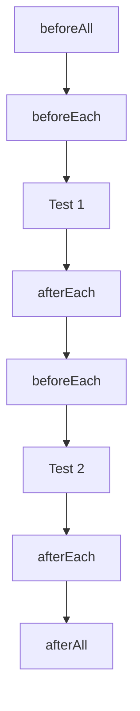

# Basic Tests

This guide covers the test runner, lifecycle hooks, and logging.

## Table of Contents

- [Test Runner](#test-runner)
- [Lifecycle Hooks](#lifecycle-hooks)
- [Logging](#logging)
- [Error Testing](#error-testing)
- [Standard Test Pattern](#standard-test-pattern)

---

## Test Runner

Tests are organized using the `opnet()` function, which creates an `OPNetUnit` test runner:

```typescript
import { opnet, OPNetUnit } from '@btc-vision/unit-test-framework';

await opnet('Suite Name', async (vm: OPNetUnit) => {
    // Register lifecycle hooks
    // Define tests with vm.it()
});
```

The `opnet()` function:

1. Creates an `OPNetUnit` instance with the suite name
2. Invokes your callback with the instance
3. Calls cleanup (`afterAll`) in a `finally` block
4. Logs panics with stack traces if anything throws

### Defining Tests

Each test is defined with `vm.it()` and runs immediately (tests are sequential):

```typescript
await vm.it('should do something', async () => {
    // Test logic here
});

await vm.it('should do something else', async () => {
    // Another test
});
```

Tests always `await` because contract calls are async.

---

## Lifecycle Hooks



### beforeAll

Runs once before all tests. Called immediately (not deferred):

```typescript
await vm.beforeAll(async () => {
    // One-time expensive setup
});
```

### beforeEach

Runs before every test. This is where you initialize the blockchain and contracts:

```typescript
vm.beforeEach(async () => {
    Blockchain.dispose();
    Blockchain.clearContracts();
    await Blockchain.init();

    // Create and register contracts
    contract = new MyContract(deployer, address);
    Blockchain.register(contract);
    await contract.init();

    // Set transaction context
    Blockchain.txOrigin = deployer;
    Blockchain.msgSender = deployer;
});
```

### afterEach

Runs after every test. Clean up resources:

```typescript
vm.afterEach(() => {
    contract.dispose();
    Blockchain.dispose();
});
```

### afterAll

Runs once after all tests. Final cleanup. Note: `Blockchain.cleanup()` is called automatically by the framework after `afterAll` runs, so you do not need to call it yourself.

```typescript
vm.afterAll(() => {
    contract.delete();
    Blockchain.dispose();
});
```

---

## Logging

`OPNetUnit` extends `Logger` from `@btc-vision/logger`. Use these methods inside tests:

```typescript
await vm.it('my test', async () => {
    vm.log('General log message');
    vm.info('Info message');
    vm.success('Success message');
    vm.warn('Warning message');
    vm.error('Error message');
    vm.debug('Debug message');
    vm.panic('Fatal error message');
});
```

Each log level has a different color in the terminal output. Use `vm.info()` for diagnostic output and `vm.success()` for confirmation messages.

---

## Error Testing

### Testing that a call throws

```typescript
await vm.it('should revert on invalid input', async () => {
    await Assert.expect(async () => {
        await contract.invalidMethod();
    }).toThrow();
});
```

### Testing for a specific error message

```typescript
await vm.it('should revert with specific message', async () => {
    await Assert.expect(async () => {
        await contract.unauthorizedAction();
    }).toThrow('not authorized');
});
```

### Testing with regex

```typescript
await vm.it('should match error pattern', async () => {
    await Assert.expect(async () => {
        await contract.badInput();
    }).toThrow(/out of (gas|memory)/);
});
```

### Testing that a call does NOT throw

```typescript
await vm.it('should succeed without error', async () => {
    await Assert.expect(async () => {
        await contract.validMethod();
    }).toNotThrow();
});
```

---

## Standard Test Pattern

Here is the canonical test pattern used throughout the framework:

```typescript
import { Address } from '@btc-vision/transaction';
import { Assert, Blockchain, opnet, OPNetUnit } from '@btc-vision/unit-test-framework';
import { MyContractRuntime } from '../contracts/runtime/MyContractRuntime.js';

await opnet('MyContract Tests', async (vm: OPNetUnit) => {
    let contract: MyContractRuntime;

    const deployerAddress: Address = Blockchain.generateRandomAddress();
    const contractAddress: Address = Blockchain.generateRandomAddress();

    vm.beforeEach(async () => {
        // 1. Reset blockchain state
        Blockchain.dispose();
        Blockchain.clearContracts();
        await Blockchain.init();

        // 2. Create and register the contract
        contract = new MyContractRuntime(deployerAddress, contractAddress);
        Blockchain.register(contract);
        await contract.init();

        // 3. Set the transaction context
        Blockchain.txOrigin = deployerAddress;
        Blockchain.msgSender = deployerAddress;
    });

    vm.afterEach(() => {
        contract.dispose();
        Blockchain.dispose();
    });

    // Test cases
    await vm.it('should read a value', async () => {
        const value = await contract.getValue();
        Assert.expect(value).toEqual(42n);
    });

    await vm.it('should write a value', async () => {
        await contract.setValue(100n);

        const value = await contract.getValue();
        Assert.expect(value).toEqual(100n);
    });

    await vm.it('should reject unauthorized calls', async () => {
        const unauthorized = Blockchain.generateRandomAddress();
        Blockchain.msgSender = unauthorized;

        await Assert.expect(async () => {
            await contract.adminMethod();
        }).toThrow();
    });
});
```

---

## Multiple Test Suites

You can have multiple `opnet()` calls in a single file:

```typescript
await opnet('Read Operations', async (vm: OPNetUnit) => {
    // ... setup ...
    await vm.it('should read value', async () => { /* ... */ });
});

await opnet('Write Operations', async (vm: OPNetUnit) => {
    // ... setup ...
    await vm.it('should write value', async () => { /* ... */ });
});
```

Or organize them across separate files and run individually:

```bash
npx tsx test/reads.test.ts
npx tsx test/writes.test.ts
```

---

## Next Steps

- [OP20 Token Tests](./op20-tokens.md) - Testing fungible tokens
- [OP721 NFT Tests](./op721-nfts.md) - Testing non-fungible tokens
- [Custom Contracts](./custom-contracts.md) - Building contract wrappers

---

[<- Previous: Quick Start](../getting-started/quick-start.md) | [Next: OP20 Token Tests ->](./op20-tokens.md)
