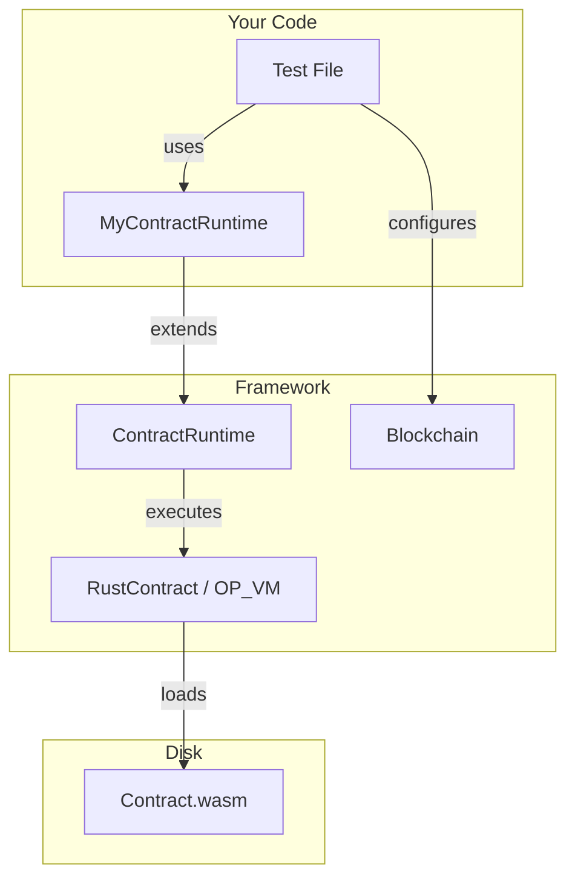

# Testing Custom Contracts

For contracts beyond OP20/OP721, extend `ContractRuntime` to create typed wrappers that map TypeScript methods to contract selectors.

## Table of Contents

- [Architecture](#architecture)
- [Creating a Runtime Wrapper](#creating-a-runtime-wrapper)
- [Selector Encoding](#selector-encoding)
- [Reading Data](#reading-data)
- [Writing Data](#writing-data)
- [Working with Storage](#working-with-storage)
- [Response Handling](#response-handling)
- [Complete Example](#complete-example)

---

## Architecture



Every contract wrapper:

1. **Extends** `ContractRuntime`
2. **Defines selectors** for each contract method
3. **Encodes calldata** with `BinaryWriter`
4. **Decodes responses** with `BinaryReader`
5. **Loads bytecode** via `BytecodeManager`

---

## Creating a Runtime Wrapper

```typescript
import { Address, BinaryReader, BinaryWriter } from '@btc-vision/transaction';
import { BytecodeManager, CallResponse, ContractRuntime } from '@btc-vision/unit-test-framework';

export class MyContractRuntime extends ContractRuntime {
    // 1. Define selectors from ABI signatures
    private readonly getValueSelector: number = this.getSelector('getValue()');
    private readonly setValueSelector: number = this.getSelector('setValue(uint256)');

    // 2. Constructor with ContractDetails
    public constructor(deployer: Address, address: Address, gasLimit: bigint = 150_000_000_000n) {
        super({
            address: address,
            deployer: deployer,
            gasLimit,
        });
    }

    // 3. Public methods that encode/decode contract calls
    public async getValue(): Promise<bigint> {
        const calldata = new BinaryWriter();
        calldata.writeSelector(this.getValueSelector);

        const response = await this.execute({ calldata: calldata.getBuffer() });
        this.handleResponse(response);

        const reader = new BinaryReader(response.response);
        return reader.readU256();
    }

    public async setValue(value: bigint): Promise<CallResponse> {
        const calldata = new BinaryWriter();
        calldata.writeSelector(this.setValueSelector);
        calldata.writeU256(value);

        const response = await this.execute({ calldata: calldata.getBuffer() });
        this.handleResponse(response);
        return response;
    }

    // 4. Optional override: custom error wrapping (default formats with class name)
    protected handleError(error: Error): Error {
        return new Error(`(MyContract: ${this.address}) OP_NET: ${error.message}`);
    }

    // 5. Override to load WASM from file (required unless `bytecode` is passed in ContractDetails)
    protected defineRequiredBytecodes(): void {
        BytecodeManager.loadBytecode('./bytecodes/MyContract.wasm', this.address);
    }

    // 6. Helper: encode ABI selector
    private getSelector(signature: string): number {
        return Number(`0x${this.abiCoder.encodeSelector(signature)}`);
    }

    // 7. Helper: validate response
    private handleResponse(response: CallResponse): void {
        if (response.error) throw this.handleError(response.error);
        if (!response.response) throw new Error('No response to decode');
    }
}
```

---

## Selector Encoding

Selectors are 4-byte identifiers derived from the function signature string. The `abiCoder` (available as `this.abiCoder` in `ContractRuntime`) encodes them:

```typescript
// The signature must exactly match the contract's ABI
private readonly mintSelector = this.getSelector('mint(address,uint256)');
private readonly balanceOfSelector = this.getSelector('balanceOf(address)');
private readonly transferSelector = this.getSelector('transfer(address,uint256)');
private readonly storeSelector = this.getSelector('store(bytes32,bytes32)');
private readonly sha256Selector = this.getSelector('sha256(bytes)');
```

### Common Parameter Types

| ABI Type | BinaryWriter Method | BinaryReader Method |
|----------|-------------------|-------------------|
| `uint8` | `writeU8(n)` | `readU8()` |
| `uint16` | `writeU16(n)` | `readU16()` |
| `uint32` | `writeU32(n)` | `readU32()` |
| `uint64` | `writeU64(n)` | `readU64()` |
| `uint128` | `writeU128(n)` | `readU128()` |
| `uint256` | `writeU256(n)` | `readU256()` |
| `bool` | `writeBoolean(b)` | `readBoolean()` |
| `address` | `writeAddress(a)` | `readAddress()` |
| `bytes` | `writeBytesWithLength(b)` | `readBytesWithLength()` |
| `bytes32` | `writeBytes(b)` | `readBytes(32)` |
| `string` | `writeString(s)` | `readString()` |

---

## Reading Data

### Simple getter

```typescript
public async getValue(): Promise<bigint> {
    const calldata = new BinaryWriter();
    calldata.writeSelector(this.getValueSelector);

    const response = await this.execute({ calldata: calldata.getBuffer() });
    this.handleResponse(response);

    const reader = new BinaryReader(response.response);
    return reader.readU256();
}
```

### Parameterized query

```typescript
public async balanceOf(owner: Address): Promise<bigint> {
    const calldata = new BinaryWriter();
    calldata.writeSelector(this.balanceOfSelector);
    calldata.writeAddress(owner);

    const response = await this.execute({ calldata: calldata.getBuffer() });
    this.handleResponse(response);

    const reader = new BinaryReader(response.response);
    return reader.readU256();
}
```

### Multiple return values

```typescript
public async getInfo(): Promise<{ name: string; value: bigint }> {
    const calldata = new BinaryWriter();
    calldata.writeSelector(this.getInfoSelector);

    const response = await this.execute({ calldata: calldata.getBuffer() });
    this.handleResponse(response);

    const reader = new BinaryReader(response.response);
    return {
        name: reader.readString(),
        value: reader.readU256(),
    };
}
```

---

## Writing Data

### Simple setter

```typescript
public async setValue(value: bigint): Promise<CallResponse> {
    const calldata = new BinaryWriter();
    calldata.writeSelector(this.setValueSelector);
    calldata.writeU256(value);

    const response = await this.execute({ calldata: calldata.getBuffer() });
    this.handleResponse(response);
    return response;
}
```

### With sender override

```typescript
public async transferOwnership(newOwner: Address, sender: Address): Promise<CallResponse> {
    const calldata = new BinaryWriter();
    calldata.writeSelector(this.transferOwnershipSelector);
    calldata.writeAddress(newOwner);

    const response = await this.execute({
        calldata: calldata.getBuffer(),
        sender: sender,      // Override msg.sender
        txOrigin: sender,    // Override tx.origin
    });

    this.handleResponse(response);
    return response;
}
```

---

## Working with Storage

For contracts with key-value storage:

```typescript
public async store(key: Uint8Array, value: Uint8Array): Promise<void> {
    const calldata = new BinaryWriter(68); // Pre-allocate: 4 (selector) + 32 + 32
    calldata.writeSelector(this.storeSelector);
    calldata.writeBytes(key);
    calldata.writeBytes(value);

    const response = await this.execute({ calldata: calldata.getBuffer() });
    this.handleResponse(response);
}

public async load(key: Uint8Array): Promise<Uint8Array> {
    const calldata = new BinaryWriter(36); // Pre-allocate: 4 + 32
    calldata.writeSelector(this.loadSelector);
    calldata.writeBytes(key);

    const response = await this.execute({ calldata: calldata.getBuffer() });
    this.handleResponse(response);

    const reader = new BinaryReader(response.response);
    return reader.readBytes(32);
}
```

---

## Response Handling

### CallResponse Fields

```typescript
const response = await contract.execute({ calldata });

response.status;           // Exit status (0 = success, 1 = revert)
response.response;         // Raw bytes (Uint8Array) to decode
response.error;            // Error if status !== 0
response.events;           // Emitted events (NetEvent[])
response.usedGas;          // Gas consumed (bigint)
response.memoryPagesUsed;  // WASM memory pages used
response.callStack;        // Contract call stack
response.touchedAddresses; // Addresses accessed during execution
response.touchedBlocks;    // Block numbers queried
```

### Returning structured data

```typescript
public async verifySignature(
    sig: Uint8Array,
    sender: Address,
): Promise<{ result: boolean; gas: bigint }> {
    const calldata = new BinaryWriter();
    calldata.writeSelector(this.verifySelector);
    calldata.writeBytesWithLength(sig);

    const response = await this.execute({
        calldata: calldata.getBuffer(),
        sender: sender,
        txOrigin: sender,
    });
    this.handleResponse(response);

    const reader = new BinaryReader(response.response);
    return {
        result: reader.readBoolean(),
        gas: response.usedGas,
    };
}
```

---

## Complete Example

Here is a full runtime wrapper and its test file, based on the actual test contracts in the framework:

### Runtime Wrapper

```typescript
// test/contracts/runtime/TestContractRuntime.ts
import { Address, BinaryReader, BinaryWriter } from '@btc-vision/transaction';
import { BytecodeManager, CallResponse, ContractRuntime } from '@btc-vision/unit-test-framework';

export class TestContractRuntime extends ContractRuntime {
    private readonly sha256Selector = this.getSelector('sha256(bytes)');
    private readonly storeSelector = this.getSelector('store(bytes32,bytes32)');
    private readonly loadSelector = this.getSelector('load(bytes32)');
    private readonly accountTypeSelector = this.getSelector('accountType(address)');
    private readonly blockHashSelector = this.getSelector('blockHash(uint64)');
    private readonly recursiveCallSelector = this.getSelector('recursiveCall(uint32)');

    public constructor(deployer: Address, address: Address, gasLimit: bigint = 150_000_000_000n) {
        super({ address, deployer, gasLimit });
    }

    public async sha256(data: Uint8Array): Promise<Uint8Array> {
        const calldata = new BinaryWriter();
        calldata.writeSelector(this.sha256Selector);
        calldata.writeBytesWithLength(data);

        const response = await this.execute({ calldata: calldata.getBuffer() });
        this.handleResponse(response);
        return new BinaryReader(response.response).readBytes(32);
    }

    public async store(key: Uint8Array, value: Uint8Array): Promise<void> {
        const calldata = new BinaryWriter(68);
        calldata.writeSelector(this.storeSelector);
        calldata.writeBytes(key);
        calldata.writeBytes(value);

        const response = await this.execute({ calldata: calldata.getBuffer() });
        this.handleResponse(response);
    }

    public async load(key: Uint8Array): Promise<Uint8Array> {
        const calldata = new BinaryWriter(36);
        calldata.writeSelector(this.loadSelector);
        calldata.writeBytes(key);

        const response = await this.execute({ calldata: calldata.getBuffer() });
        this.handleResponse(response);
        return new BinaryReader(response.response).readBytes(32);
    }

    public async accountType(address: Address): Promise<number> {
        const calldata = new BinaryWriter(36);
        calldata.writeSelector(this.accountTypeSelector);
        calldata.writeAddress(address);

        const response = await this.execute({ calldata: calldata.getBuffer() });
        this.handleResponse(response);
        return new BinaryReader(response.response).readU32();
    }

    public async blockHash(blockNumber: bigint): Promise<Uint8Array> {
        const calldata = new BinaryWriter(12);
        calldata.writeSelector(this.blockHashSelector);
        calldata.writeU64(blockNumber);

        const response = await this.execute({ calldata: calldata.getBuffer() });
        this.handleResponse(response);
        return new BinaryReader(response.response).readBytes(32);
    }

    public async recursiveCall(depth: number): Promise<void> {
        const calldata = new BinaryWriter();
        calldata.writeSelector(this.recursiveCallSelector);
        calldata.writeU32(depth);

        const response = await this.execute({ calldata: calldata.getBuffer() });
        this.handleResponse(response);
    }

    protected handleError(error: Error): Error {
        return new Error(`(TestContract: ${this.address}) OP_NET: ${error.message}`);
    }

    protected defineRequiredBytecodes(): void {
        BytecodeManager.loadBytecode('./bytecodes/TestContract.wasm', this.address);
    }

    private getSelector(sig: string): number {
        return Number(`0x${this.abiCoder.encodeSelector(sig)}`);
    }

    private handleResponse(response: CallResponse): void {
        if (response.error) throw this.handleError(response.error);
        if (!response.response) throw new Error('No response to decode');
    }
}
```

### Test File

```typescript
// test/test-contract.test.ts
import { Address } from '@btc-vision/transaction';
import { Assert, Blockchain, opnet, OPNetUnit } from '@btc-vision/unit-test-framework';
import { TestContractRuntime } from './contracts/runtime/TestContractRuntime.js';

await opnet('TestContract', async (vm: OPNetUnit) => {
    let contract: TestContractRuntime;
    const deployer: Address = Blockchain.generateRandomAddress();
    const contractAddress: Address = Blockchain.generateRandomAddress();

    vm.beforeEach(async () => {
        Blockchain.dispose();
        Blockchain.clearContracts();
        await Blockchain.init();

        contract = new TestContractRuntime(deployer, contractAddress);
        Blockchain.register(contract);
        await contract.init();

        Blockchain.txOrigin = deployer;
        Blockchain.msgSender = deployer;
    });

    vm.afterEach(() => {
        contract.dispose();
        Blockchain.dispose();
    });

    await vm.it('should hash data with SHA256', async () => {
        const data = Uint8Array.from([0x3d]);
        const hash = await contract.sha256(data);
        Assert.expect(hash.length).toEqual(32);
    });

    await vm.it('should store and load data', async () => {
        const key = new Uint8Array(32).fill(0x01);
        const value = new Uint8Array(32).fill(0x42);

        await contract.store(key, value);
        const loaded = await contract.load(key);

        Assert.expect(loaded).toDeepEqual(value);
    });

    await vm.it('should identify contract addresses', async () => {
        const accountType = await contract.accountType(contract.address);
        Assert.expect(accountType).toEqual(1); // 1 = contract
    });

    await vm.it('should fail on excessive recursion', async () => {
        await Assert.expect(async () => {
            await contract.recursiveCall(100);
        }).toThrow();
    });
});
```

---

## Next Steps

- [Contract Runtime API Reference](../api-reference/contract-runtime.md) - Full API details
- [Cross-Contract Calls](../advanced/cross-contract-calls.md) - Multi-contract testing
- [Upgradeable Contracts](../advanced/upgradeable-contracts.md) - Testing upgrades

---

[<- Previous: OP721 NFT Tests](./op721-nfts.md) | [Next: Cross-Contract Calls ->](../advanced/cross-contract-calls.md)
